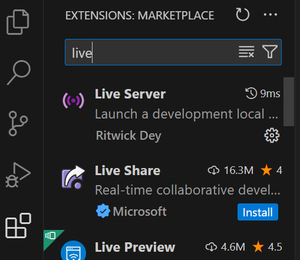
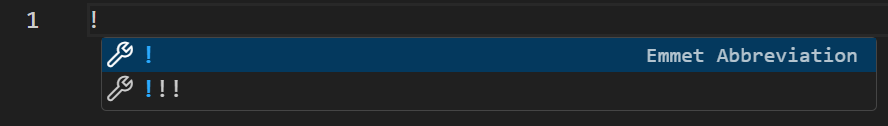
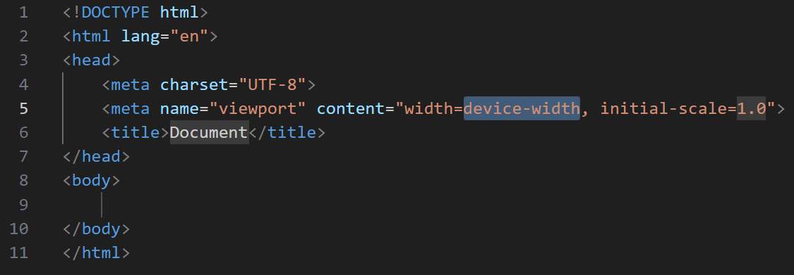
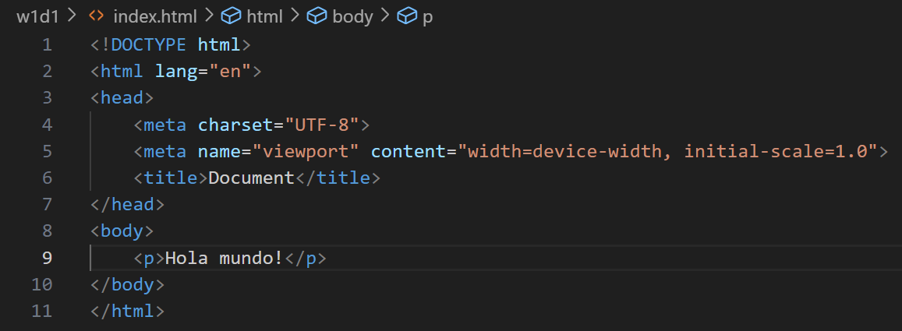

## ¿Qué es HTML?

Es el esqueleto de nuestra página web.

HTML nos permite crear elementos que acabarán siendo accesibles tanto para CSS como para JS, por lo que es indispensable crear una buena estructura.
Para que una estructura sea buena, esta debe ser ajustada a nuestras necesidades (es decir, que pueda mover los elementos que tengo que mover), semántica (es decir, que cada elemento diga, en la medida de lo posible, qué hay en su interior) y modular (es decir, que se pueda modificar con facilidad).

Por ejemplo, si yo creo una web donde en la cabecera hay una imagen y un título y no creo una estructura correcta, luego puede ser complicado acceder solo al título (para animarlo, por ejemplo) o acceder solo a la imagen (para ajustar sus medidas, por ejemplo). Piensa en el HTML como tu esqueleto, para mover el brazo necesitas el hombro y el codo, si faltase uno de los dos tendrías dificultades a la hora de moverte.

### Cómo empezar en HTML

Usa visual studio code, puedes descargártelo [aquí](https://code.visualstudio.com/)

Instala en extensiones el Live Server 

Crea un archivo con extensión html. Por ejemplo: "index.html". Recuerda ponerlo todo en minúscula.

Una vez en el archivo, escribe "!" y te aparecerá un menú desplegable. Selecciona la primera opción. []
Al hacerlo deberías acabar teniendo algo tal que así: 

Dentro de Head tenemos los metadatos, nosotros vamos a trabajar el HTML dentro de Body.

Por ejemplo, para crear un texto que diga "hola mundo!" deberíamos acabar teniendo algo tal que así:

Una vez hecho esto, podemos empezar a hablar de HTML

## Ejemplos de contenidos semánticos.
Son aquellas etiquetas que nos avisan de qué hay en el interior de la etiqueta. Por ejemplo, Header, Footer, Nav, Aside, h, details, figure, mark...

### Header

El header es la cabecera, no lo confundas con el head (que son los metadatos de la página). Aquí suele haber un logo, información del autor...

### Footer

Es el pie de página. Normalmente hay datos de contacto, copyright, un mapa de la web...

### Nav

Es el elemento que contiene el mapa de navegación, normalmente estará dentro del header, aunque puede haber escepciones, como los mapas de navegación laterales.

### h1

La letra h es un diminutivo de Header, cabecera. Ya ves que aquí los nombres se acaban pareciendo, el naming (nombre por el que se conoce al buen uso de bautizar elementos) es algo por lo que vosotros pasaréis en un futuro.
En una página web debe haber 1 y solo 1 h1. Ya que es un valor que google utiliza para saber de qué va esa página. Es una mala práctica utilizar más de 1 h1, igual de mala práctica es no utilizar ningún h1.

### h2...h5

Lo mismo que con h1. Pero se pueden utilizar varios. Normalmente dentro de un h2 podrá haber varios h3, pero dentro de un h2 no debería haber un h2. Y así con el resto de números.

### Sobre los h en general

Piensa en ellos como en un libro.
h1 es el nombre del libro, y solo debe haber un nombre.
h2 es el nombre de un capítulo del libro, y aunque puede haber varios, no debería haber capítulos dentro de capítulos. Ya que a un capítulo dentro de un capítulo lo llamamos apartado o sub-capítulo.
h3 es el nombre de un apartado dentro de un capítulo o un sub-capítulo.
h4 es el nombre de un elemento concreto dentro de un capítulo. Por ejemplo, el nombre de una infografía.
h5 es el nombre de un elemento concreto dentro de un h4.

Así podríamos decir que en el libro "Sobre las patatas" (h1), en el capítulo 1 "La mejor patata del mundo" (h2), podemos encontrar una sección sobre "la mejor patata de europa" (h3) que contiene una fotografía llamada "fotografía de la patata" (h4) que dentro de ella tiene un refrán popular que dice "La mejor patata, es la patata asada" (h5).

Como ves, hay que currárselo para llegar a usar un h5. Si llegas a necesitar un h6 plantéate que quizás estés haciendo excesivamente compleja tu web.

## Ejemplos de contenidos no semánticos.
Son aquellas etiquetas que nos dan poca o nula información de qué hay en su interior, por ejemplo Section, Article, Div, p...

## Consejo
No te obsesiones con esta diferenciación, ya que en ocasiones es arbitrario decir si una etiqueta es semántica o no lo es. Simplemente quédate con lo importante que es:

> Si hay una etiqueta específica para lo que quieres hacer, deberías estar utilizando dicha etiqueta.

Dicho esto, tampoco es un drama si no lo haces, son muchas etiquetas HTML y hay que irlas aprendiendo poco a poco.

Para poder ver todas las etiquetas, puedes ir a [esta página web](https://www.w3schools.com/tags/).

W3 School es una de las páginas que más deberías visitar. Te recomiendo ponerla en favoritos. 

### Section, Article y Div

Son los contenidos no semánticos por excelencia. Dentro de ellos podremos encontrar otros elementos relacionados entre sí.
Por ejemplo, dentro de un section en una página web como amazon podremos poner galerías de imágenes dentro de un div.

## Recomendación de ejercicio 1 - De visita por la web.

Ve a páginas webs que suelas visitar, presiona F12 o dale a botón derecho -> Inspeccionar. Te recomiendo usar Google Chrome para este propósito.
Examina con el puntero, utilizando la herramienta apropiada, la página web para ver cómo está estructurada e irte familiarizando con estas jerarquías.
Visita tanto páginas webs complejas como páginas webs simples.

## Recomendación de ejercicio 2 - Lectura rápida.
Visita el listado de [etiquetas HTML](https://www.w3schools.com/tags/). Leételas todas para que te vayan sonando. 
Cada día de esta semana, antes de empezar la clase y/o al acabarla, leéte la lista completa. Así irás aprendiéndolas poco a poco y de manera orgánica.

## Recomendación de ejercicio 3 - Replicando una estructura.
Analiza la página web de [Marvel](https://www.marvel.com/), intenta identificar qué es la cabecera, qué es un div/section/article... y luego mira su estructura a ver si has acertado.

## Recomendación de ejercicio 4 - Tus propios apuntes.
A lo largo del curso tendrás muchas fuentes de información: las clases, los apuntes de Iron Hack, los ejercicios que vamos haciendo, cosas que tú mismo encontrarás...

Te recomiendo crear un repositorio con tus propios apuntes en formato .md (markdown), así aprenderás a utilizar markdown, repasarás el contenido y lo tendrás accesible a tu manera más adelante. Algo que te resultará imprescindible.

