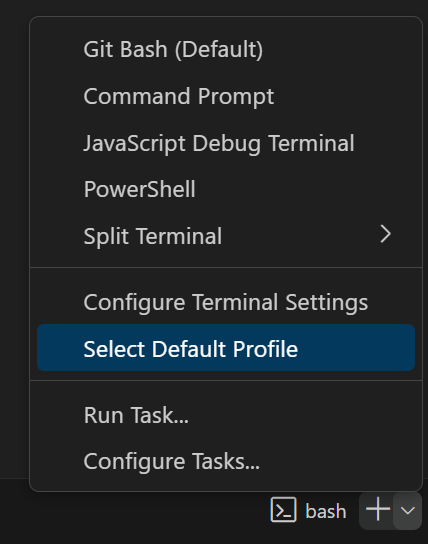

1. Cambio de enlace de ZOOM. [Nuevo enlace]()
2. Usa git bash como terminal por defecto en visual studio code. 
3. Instalación del SSH de github en tu ordenador.
4. Consola, cómo navegar por ella y cómo subir tu repositorio.
5. Entregar los repositorios en la plataforma.
6. Instalamos Prettier

