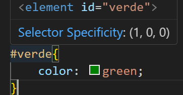
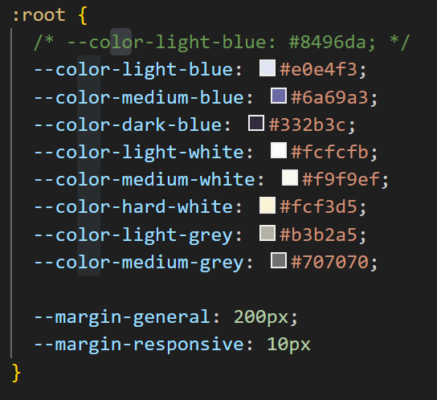
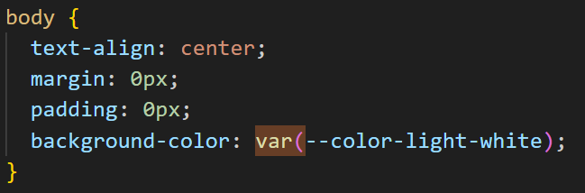

# CSS

## ¿Qué es CSS?

Un lenguaje de estilado de hojas, su nombre proviene de Cascading Style Sheets.

## ¿Qué se puede hacer con CSS?

Maquetar una página para ponerla bonita.

Para ello podremos modificar una infinidad de atributos e incluso crear cierto tipo de animaciones, así como modificar tantos elementos HTML como, hasta cierto grado (como la proporción, repetición, etc.) imágenes, vídeos y otros recursos.

Para poder usar CSS debemos apuntar a un elemento HTML. Recuerda que los nombres de las clases deben estar en kebab-case. Es decir, todo en minúscula y separado por un guion. esto-es-un-ejemplo.

Recuerda además que una de las herramientas más potentes que tienes es la de inspeccionar elemento. Así que aprende a usarla pronto. En Google Chrome basta con darle a F12 o botón derecho sobre el elemento -> inspeccionar elemento.

## ¿Cómo usar CSS?

1. Crea un archivo "style.css"
2. Vincula tu archivo HTML al archivo de style. Para ello usa `<link rel="stylesheet" type="text/css" href="styles.css" />`
   1. link indica el tipo de etiqueta
   2. rel indica cómo se relaciona este elemento con otros elementos de la web
   3. type indica el tipo de archivo
   4. href indica dónde se encuentra el archivo que buscamos y cómo se llama. Cambia este nombre en caso necesario.
3. Estudia las jerarquías de CSS
   1. La jerarquía más baja es la etiqueta.
   2. La siguiente jerarquía es la clase.
   3. La última jerarquía es la ID
   4. En caso de empate de jerarquía, se desempata eligiendo lo que esté escrito más abajo en el archivo CSS.
   5. Posteriormente se pueden utilizar modificadores que se saltan la jerarquía, pero esto no es una práctica correcta.
   6. Aprende a leer el selector de especificidad.
      1. Gana el selector que tenga el primer número más alto (el de ID)
      2. En caso de empate, gana el que tenga el número en segunda posición más alto (el de clase)
      3. En caso de empate, gana el que tenga el número en tercera posición más alto (el de etiqueta)
      4. En caso de empate, se resuelve dando prioridad a lo último que fue escrito en CSS
4. Si lo necesitas, usa jerarquías complejas utilizando elementos como el espacio en blanco o los símbolos +,>,||,~, | revísalo en [Combinators and separators](https://developer.mozilla.org/en-US/docs/Web/CSS/CSS_selectors)
5. En caso de necesidad, usa los pseudoselectores
   1. :hover -> Es activado cuando el ratón está puesto encima del elemento.
   2. :focus -> Es activado cuando el elemento está activo, por ejemplo cuando estás haciendo click sobre él. Ideal para cuando hay una caja de texto, ya que esta permanece activa incluso cuando no haces click.
   3. :active -> Es activado cuando el elemento está siendo clicado.
   4. Revisa la [documentación](https://developer.mozilla.org/en-US/docs/Web/CSS/CSS_selectors), en particular son muy usadas las siguientes:
      1. first-child
      2. nth-child
      3. last-child
      4. root
      5. universal selector
6. Nociones importantes
   1. Recuerda crear el CSS en el mismo orden en el que lees un texto. De izquierda a derecha y de arriba abajo.
   2. El punto (0.0) de CSS se encuentra en la parte superior izquierda de tu pantalla. Nunca habrás visto una página que empieza abajo y acaba arriba.
   3. Recuerda que puedes crear comentarios y variables en CSS para luego rescatarlas. Aquí un ejemplo:  
   4. Recuerda que un elemento HTML puede tener varias clases. Así si tienes la clase "cursiva" y la clase "texto-rojo" podrías tener un `
` y se aplicarían ambos estilos. Basta con separarlos con espacios.
   5. Recuerda que tu browser tiene un estilo por defecto. Para comprobar cómo afecta basta con inspeccionar el elemento.

## Recomendación de ejercicio 1 - Maqueta una página.

El enfrentarte a dificultades es lo que te lleva a dominar CSS. Por eso, además de los ejercicios oficiales de maquetación te recomiendo que pruebes a darte de bruces con páginas más difíciles. Así, si has conseguido dominar lo básico podrás empezar a experimentar con nuevas funciones de CSS.

Te dejo aquí dos ejemplos de páginas que deberían resultarte todo un desafío imposible de superar si no usas un HTML bien organizado y un buen uso del CSS.

Recuerda no complicarte la vida, usa siempre la misma imagen de fondo para todo. No nos importa ahora mismo que la imagen sea la correcta, nos importa que el HTML y el CSS sean apropiados.

[Jaime Altozano](https://jaimealtozano.com/)
[Rbg Escuela](https://rbgescuela.com/)
[Carles Mashall](https://cursos.carlesmarsal.com/)
[MaieuticApps](https://maieuticapps.com/)
[Humble bundle](https://www.humblebundle.com/)
