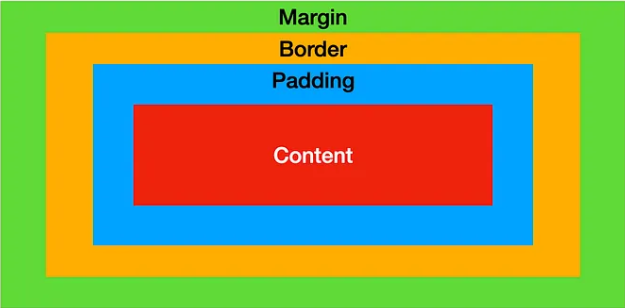
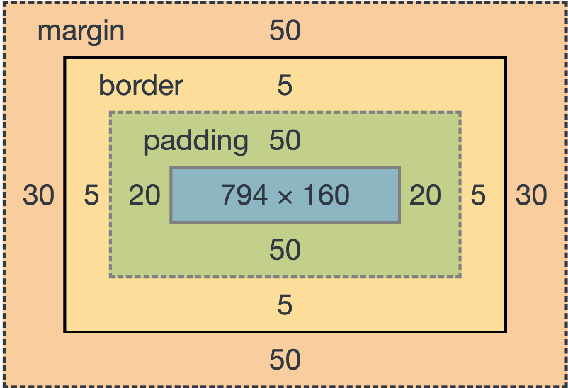

# Forms y CSS

Ejemplos de web y CSS

[Artículo](https://www.linkedin.com/pulse/10-html-css-portfolio-websites-demo-source-code-codewithrandom-author-uwfxf/)
[CSS Art](https://css-art.com/pure-css-lace/)
[Ejemplos CSS](https://dgrees.studio/)
[Web CSS animaciones](https://animista.net/play/exits/swirl-out)

## Qué es un form - HTML

Un form es un conjunto de datos que se recogen a la vez para ser procesados al mismo tiempo.

Por ejemplo, en una plataforma de pago el form sería tu nombre, tu tarjeta de crédito y el código de seguridad.

O, cuando mandas un e-mail, el form sería tu nombre, tu e-mail, el asunto, la dirección de destino y el mensaje.

Los form son muy utilizados y aunque al principio cuesta ver algunas relaciones hay que dominarlos completamente.

## Qué es el box-model - CSS

Todo elemento es una caja. Supongamos un elemento al que llamaremos "patata".

Margin -> Es la caja que separa una patata de otra patata. (Sería el espacio entre patatas en una bolsa)
Border -> Es la línea que demarca la patata. (Sería la piel)
Padding -> Es el espacio que hay dentro de la patata. (La parte amarilla que echas a freir)
Content -> Es aquello que le da sustancia a la patata y que se distribuye por todo su interior (almidón, hidratos de carbono, etc.)




### ¿Cuándo usaremos cada apartado?

[Margin](https://developer.mozilla.org/en-US/docs/Web/CSS/margin) -> Se usa cuando quieres separar dos elementos.
[Border](https://developer.mozilla.org/en-US/docs/Web/CSS/border) -> Se usa cuando quieres demarcar el contorno del elemento.
[Padding](https://developer.mozilla.org/en-US/docs/Web/CSS/padding) -> Se usa cuando quieres expandir los dominios del elemento más allá del content.
[Content](https://developer.mozilla.org/en-US/docs/Web/CSS/content) -> Se usa para modificar vía CSS el contenido del elemento.

### Unidades de medida

px -> Píxeles. Es una unidad absoluta, mide lo que mide y punto. En cada pantalla un pixel es distinto. Un pixel será más grande en una pantalla HD de 27' que en una pantalla 4K u 8K de 27'
em -> Unidad relativa al tamaño de la fuente del elemento padre. Si el elemento padre tiene 12 de tamaño de fuente, 1em valdrá 12 para ese elemento.
rem -> Unidad relativa al tamaño de la fuente del root (raíz). Si la raíz tiene 12 de tamaño de fuente, 1 rem valdrá 12 para ese elemento.
vw -> view width. Literalmente el ancho de la pantalla. Se mide en porcentaje siendo 0 la nada y 100 el ancho total de la pantalla.
vh -> view height. Lo mismo que vw pero respecto a la altura.

Hay más [unidades](https://www.w3schools.com/cssref/css_units.php), pero estas son las más comunes.

### Posicionamiento

El posicionamiento es el cómo se va a mostrar un elemento en pantalla.

static -> Es lo mismo que no posicionar. Un elemento estático tiene un comportamiento por defecto.
relative -> Añade coordenadas a un elemento estático para moverlo de su sitio. El hueco del elemento se mantiene como si estuviese ahí, aunque se haya desplazado. !!!!
absolute -> Añade coordenadas a un elemento estático para moverlo de su sitio. El display general ignorará este elemento, por lo que su hueco original puede ser ocupado por otro elemento. Las coordenadas para colocar el elemento se miden desde el punto (0,0) de la web, es decir, desde la esquina superior izquierda.
fixed -> Mantiene un elemento siempre en el mismo punto de la pantalla.

### Consejos importantes para CSS

1. Trabaja en orden de lectura. De izquierda a derecha y de arriba abajo.
2. Utiliza comentarios claros en tu código CSS para explicar la función de cada sección o regla.

```css
/* Estilos para el encabezado */
h1 {
  color: red;
}
```
