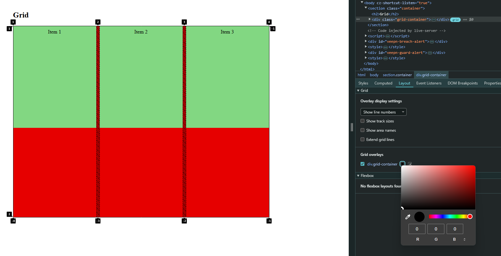

# Guía: Grid en CSS

CSS Grid Layout es un sistema de diseño bidimensional que permite crear diseños complejos y responsivos con facilidad. A diferencia de Flexbox, que se enfoca en una dimensión (fila o columna), Grid trabaja en ambas dimensiones simultáneamente, ofreciendo un control total sobre filas y columnas.

## Conceptos básicos

El sistema Grid se basa en dos componentes principales:

1. **Contenedor Grid:** El elemento que contiene los elementos en la cuadrícula. Se define con la propiedad `display: grid;`.
2. **Elementos Grid:** Los elementos hijos directos del contenedor Grid, que se posicionan dentro de la cuadrícula.

### Versión simple.

Se llama grid, porque es una rejilla. Como un tablero de ajedrez o una hoja excel.
Las columnas son verticales.
Las filas son horizontales.
El contenedor es el `grid-container`.

- `grid-template-columns` dice cuántas columnas hay. Usa `fr` para asignar "fracciones" del espacio.
- Puedes usar la función repeat(número de columnas, dimensión de la columna) para no tener que escribir cada columna a mano.
- Puedes usar la función minmax(tamaño mínimo, tamaño máximo) para establecer rangos de tamaño.
- Lo mismo para `grid-template-rows`
  Los hijos directos son los `grid-item`.
- Para colorcar al hijo usa `grid-column` seguido de el valor de inicio/valor de cierre. Por ejemplo: `grid-column: 1/5;`
- Lo mismo para `grid-row`
  Para ver la distribución, ve a inspeccionar, laout y usa un color negro. Así lo verás mejor.
  

### Propiedades del contenedor Grid

- **`display: grid;`**: Activa el modelo Grid en el contenedor.
- **`grid-template-rows` y `grid-template-columns`:** Define las filas y columnas de la cuadrícula.
  - Ejemplo: `grid-template-columns: 1fr 2fr 1fr;` crea tres columnas, donde la primera y la última ocupan el mismo espacio, y la del medio el doble.
- **`gap`:** Define el espacio entre las filas y columnas.
  - Ejemplo: `gap: 20px;`.
- **`grid-template-areas`:** Permite asignar nombres a áreas específicas de la cuadrícula.
- **`justify-items` y `align-items`:** Controlan la alineación de los elementos dentro de sus celdas.

### Propiedades de los elementos Grid

- **`grid-column` y `grid-row`:** Definen en qué filas y columnas debe colocarse un elemento.
  - Ejemplo: `grid-column: 1 / 3;` posiciona el elemento desde la primera columna hasta la tercera (sin incluir).
- **`grid-area`:** Permite colocar un elemento en un área específica definida por `grid-template-areas`.

## Ejemplo: Carátulas de películas con Grid

A continuación, se muestra un ejemplo práctico que utiliza Grid para organizar carátulas de películas en un diseño uniforme.

### Código HTML

```html
<section id="caratulas-grid" class="section">
  <h2>Carátulas de Películas</h2>
  <div class="grid-container">
    <div class="caratula">
      
      <p>La Aventura del Cosmos</p>
    </div>
    <div class="caratula">
      
      <p>Sombras Eternas</p>
    </div>
    <div class="caratula">
      
      <p>El Sueño de Aquiles</p>
    </div>
    <div class="caratula">
      
      <p>Héroes del Tiempo</p>
    </div>
  </div>
</section>
```

### Código CSS

```css
/* Contenedor Grid */
.grid-container {
  display: grid;
  grid-template-columns: repeat(auto-fit, minmax(200px, 1fr));
  gap: 2rem;
  padding: 2rem;
}

.caratula {
  background-color: #fff;
  border-radius: 8px;
  box-shadow: 0 4px 6px rgba(0, 0, 0, 0.1);
  overflow: hidden;
  text-align: center;
}

.caratula img {
  width: 100%;
  height: auto;
  display: block;
}

.caratula p {
  margin: 1rem 0;
  font-size: 1rem;
  color: #333;
}
```

## Explicación del ejemplo

1. **Estructura:**

   - El contenedor `.grid-container` utiliza `display: grid` con `grid-template-columns: repeat(auto-fit, minmax(200px, 1fr));` para crear columnas responsivas.
   - El número de columnas se ajusta automáticamente según el espacio disponible.

2. **Estilos:**
   - `gap: 2rem` introduce espacio uniforme entre las celdas de la cuadrícula.
   - Cada carátula tiene bordes redondeados y sombras para un diseño atractivo.

## Beneficios de Grid

- **Diseño bidimensional:** Permite controlar filas y columnas simultáneamente.
- **Responsividad sencilla:** Puedes crear diseños que se adapten automáticamente a cualquier tamaño de pantalla.
- **Control preciso:** Facilita la alineación y distribución de elementos.
