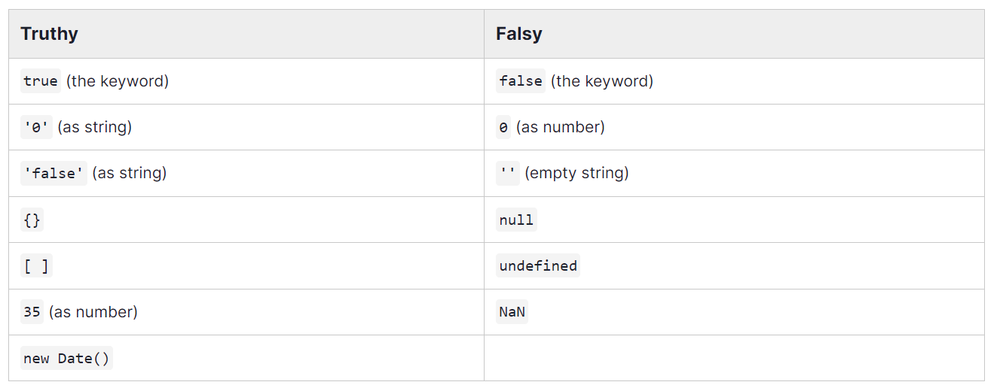

# Operadores

## Booleanos

Recuerda que una variable booleana simplemente significa una variable que es verdadera o falsa. Solo puede tomar esos valores.

JS funciona haciendo que los valores "verdaderos" sean aquellos que, intuitivamente, tienen información.
Cualquier valor será verdadero si:

- Es true
- Es un número distinto de 0
- Es un String distinto al string vacío ("")
- Es un objeto {} (aunque esté vacío)
- Es un array [] (aunque esté vacío)
- Si NO es nulo
- Si NO es undefined

Cualquier valor será falso si, por definición, no es verdadero. Es más simple definir los valores falsos por oposición a los verdaderos.



Ahora, tenemos que trabajar con valores booleanos. Para ello tenemos que usar los operadores.

### Los operadores booleanos

#### && el operador Y

A veces queremos juntar 2 o más condiciones para saber si algo es verdadero o falso.

Imaginemos un portero de discoteca que solo te deja pasar si eres mayor de edad Y si vas bien vestido. En este caso usamos el operador "Y".

bienVestido && mayorDeEdad -> Será true cuando ambas variables sean true. Basta con que una no lo sea, para que el resultado sea false.

- && -> operador "and", en español "Y".

#### || el operador O

Imaginemos un restaurante que solo te da mesa si tienes reserva O si hay mesas libres. Lo expresaríamos así.

tienesMesa || hayMesasLibres -> Será true cuando al menos una de las dos variables sea true.

- || -> Operador "or", en español "o".

#### ! el operador not

Imaginemos un portero de discoteca al que se le dice que deje pasar a quien no sea menor de edad.

En ese caso tendremos la variable "menorDeEdad" en lugar "mayorDeEdad" por lo que debemos expresar "No menorDeEdad" lo que en programación se hace así.

!menorDeEdad -> Será true cuando menorDeEdad sea false ya que el operador ! niega lo que viene después. Es, literalmente, decir "no". O sea "No menor de edad".

Hay un truco muy utilizado para convertir una variable cualquiera a booleano. Usar !! por ejemplo, si yo tengo el número 3 y quiero convertirlo a booleano, es muy común que lo veamos expresado en la forma "!!3".

Esto es así porque cuando usamos la admiración y negamos, JavaScript entiende, automáticamente, que lo que viene después debe ser un booleano y, si no lo es, lo convierte en booleano. Pero claro, la admiración niega, por lo que lo convierte en un booleano pero le ha cambiado el sentido.

En el ejemplo, si yo convierto 3 en booleano, debería darme "true", pero !3 me da false.

Es por eso que se añade otra admiración, porque igual que en matemáticas, menos por menos, es más. Una doble negación convierte la variable a su valor booleano original. Así !!3 = true.

Esta es la forma más corta de convertir algo a booleano y por ser la más corta, es la más usada.

## Matemáticos

Ya los repasamos en la clase del viernes:

- **'+'**: Suma.
- **'-'**: Resta.
- **'/'**: División.
- **'\*'**: Multiplicación. Si pones dos seguidos, harás una exponenciación.
- **%**: Resto o módulo. Por ejemplo 5%2 = 1, 10%7 = 3.
- **!**: Negación. Si lo que viene después es true, lo convierte en false. Si lo que viene después es false lo convierte en true.

- **=**: ¡No te fíes! El símbolo igual no es lo mismo en programación que en matemáticas. Te voy a decir cómo se lee en javaScript.

```javascript
x = y -> A la variable x asígnale el valor de y. Es decir, que x va a cambiar su valor mientras que y va a permanecer inalterado.
x == y -> Comprueba si x e y tienen el mismo valor. (Por ejemplo, x = 1 e y = "1") -> Esto devolvería "Verdadero"
x === y -> Comprueba si x e y tienen el mismo valor y tipo. (Por ejemplo, x = 1 e y = "1") -> Esto devolvería "Falso", ya que x e y valen lo mismo, pero x es un number e y es un string.
```

A esto les podemos añadir operadores clásicos como son:

- **+=**: Añadir. Si tienes una variable, por ejemplo "resultado" y usas este operador, lo que haces es añadir lo que va a la derecha a lo que ya hay en la variable.

```javascript
resultado += 3 -> Añade 3 a lo que ya hubiese en la variable resultado.
resultado = resultado + 3 -> Es exactamente lo mismo, solo que más largo.
```

De la misma forma que está el operador += tenemos los operadores -=, \*=, /=...

### Su uso en String

De la misma forma que puedo sumar números, puedo sumar cadenas de caracteres.
"Hola" + ", qué tal" = "Hola, qué tal"

Esto es inmediato, pero si intentas usar otros operadores verás que no puedes. Para String usa solo la suma. De lo contrario recibirás un valor NaN (Not a number).
