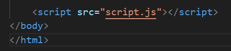

# DOM

## ¿Qué es el DOM?

Document Object Model -> Vamos, para nosotros la suma de HTML y CSS

Es la forma en la que podemos acceder, desde JS a toda la página web.

## ¿Cómo accedo al DOM?

Usando la palabra reservada "document". Por ejemplo "document.getElementById()" buscará en el documento un elemento por su id.

## Precaución!

Recuerda poner tu tag script al final del body, de lo contrario estarás ejecutando el código antes de que cargue la web.

## ¿Qué es un Evento?

Un evento es algo que sucede en el dom.

Por ejemplo, que un usuario envíe un formulario o haga click en algún botón.

## ¿Cuáles son los eventos más comunes?

1. click
2. dblclick
3. keypress
4. keydown
5. keyup

Si quieres conocer más, mira la [lista completa](https://www.w3schools.com/jsref/dom_obj_event.asp)
