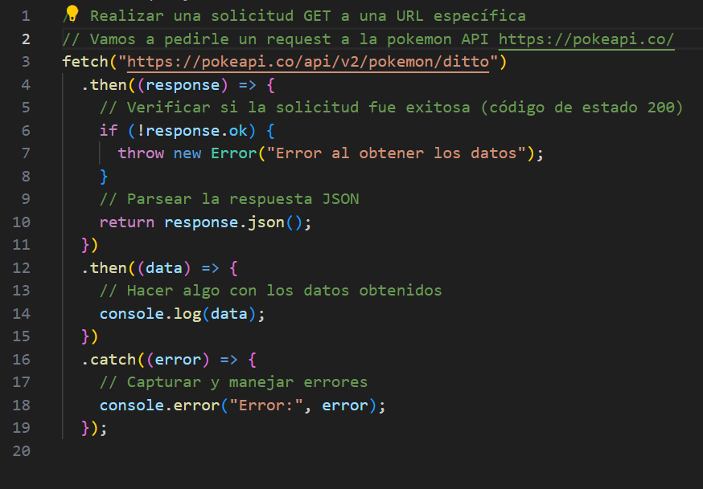

# Asincronía

## ¿Qué es la asincronía?

Hasta ahora hemos estado programando siguiendo una receta. Primero hago A, luego hago B, luego hago C...

Pero ¿Hay otra forma de hacer las cosas?

Piensa en cuando cocinas. Quizás haces varias cosas a la vez. Por ejemplo, mientras la comida está en el horno, tú vas fregando los platos. Es decir, que puede haber dos cosas haciéndose a la vez. ¡Eso es la asincronía! Hacer 2 o más cosas a la vez.

#### Cómo vamos a falsear la asincronía

Si nos conectamos a un servidor no hace falta falsearla, pero si hubiera que hacerlo tenemos los métodos setTimeOut, clearTimeOut, setInterval y clearInterval.

1. setTimeout() y clearTimeout():
   setTimeout() se utiliza para ejecutar una función una vez después de un cierto período de tiempo, especificado en milisegundos.
   clearTimeout() se utiliza para cancelar la ejecución de una función que fue programada para ejecutarse después de un cierto tiempo con setTimeout().

2. setInterval() y clearInterval():
   setInterval() se utiliza para ejecutar una función repetidamente a intervalos regulares de tiempo, especificados en milisegundos.
   clearInterval() se utiliza para detener la ejecución de una función que fue programada para ejecutarse repetidamente con setInterval().

## ¿Cuándo se usa?

Cuando pedimos datos a una API.

Una API, de forma simple, es un servidor que me devuelve datos.

Una API, de forma técnica, es una Application Programming Interface, y consiste en un conjunto de reglas y protocolos que nos permiten interactuar entre distintas aplicaciones.

En esencia nosotros las vamos a usar como bases de datos. Aquí algunos ejemplos.

- APIS
- [PokeAPI](https://pokeapi.co/)
- [Star Wars](https://swapi.dev/)
- [Dragon Ball](https://web.dragonball-api.com/)
- [Space X launches](https://api.spacexdata.com/v4/launches)
- [Más ejemplos](https://rootstack.com/es/blog/cuales-son-las-api-mas-utilizadas-en-el-desarrollo-de-aplicaciones)

Busca en google API + lo que quieras y quizás alguien haya montado una API de eso :) nunca se sabe.

## ¿Qué es un request?

Cuando pedimos datos a una API estamos haciendo un request.

En esta imagen ves una request a la API de pokemon.


## Cómo se hacen las request

Hay varias maneras, como de costumbre, pero en este caso sí que nos vamos a centrar en una concreta que es la que menos problemas da.

```javascript
fetch("https://pokeapi.co/api/v2/pokemon/ditto")
  .then((response) => {
    // Verificar si la solicitud fue exitosa (código de estado 200)
    if (!response.ok) {
      throw new Error("Error al obtener los datos");
    }
    // Parsear la respuesta JSON
    return response.json();
  })
  .then((data) => {
    // Hacer algo con los datos obtenidos
    console.log(data);
  })
  .catch((error) => {
    // Capturar y manejar errores
    console.error("Error:", error);
  });
```

1. Ponemos fetch(URL). Esto mandará la petición a la url solicitada.
2. Ponemos .then( () => {} ). Esto espera a recibir respuesta.
3. Ponemos .then( (response) => {} ). Esto hace que lo que sea que recibamos desde la URL se almacene en "response".
4. Ponemos .then( (response) => {ponemos la lógica} ). Así añadimos la lógica para operar con la respuesta.
5. Si lo necesitamos, añadimos más .then
6. Si queremos o necesitamos recoger posibles errores, añadimos al final .catch ((error) => {lógica del error})

## Qué es una promesa

Una promesa es un objeto que tiene tres estados.

1. Pendiente (pending): Estado inicial, la promesa está aún no resuelta.
2. Cumplida (fulfilled): La operación asíncrona se completó con éxito y se cumple la promesa.
3. Rechazada (rejected): La operación asíncrona falló y se rechaza la promesa.

Una vez que una Promesa está en un estado cumplido o rechazado, se considera "establecida" y no puede cambiar de estado.

## La forma moderna async/await

- async/await es una sintaxis de JavaScript introducida en ECMAScript 2017 (ES8) que simplifica aún más el manejo de código asíncrono.
- Permite escribir código asíncrono de manera más parecida a código síncrono, lo que mejora la legibilidad y el flujo del código.
- async se utiliza para declarar una función asíncrona, mientras que await se utiliza dentro de la función async para esperar la resolución de una Promesa. Esto evita la necesidad de encadenar métodos .then() y .catch().

```javascript
async function miFuncionAsincrona() {
  try {
    let resultado = await miPromesa;
    console.log("Promesa resuelta:", resultado);
  } catch (error) {
    console.error("Error:", error);
  }
}
```

Tanto las Promesas como async/await son herramientas útiles para trabajar con código asíncrono en JavaScript. Las Promesas son una base sobre la cual se construye async/await, y cada una tiene sus propias ventajas y casos de uso. Async/await proporciona una sintaxis más intuitiva y legible para trabajar con código asíncrono
