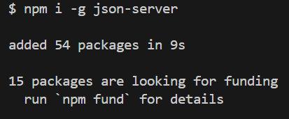
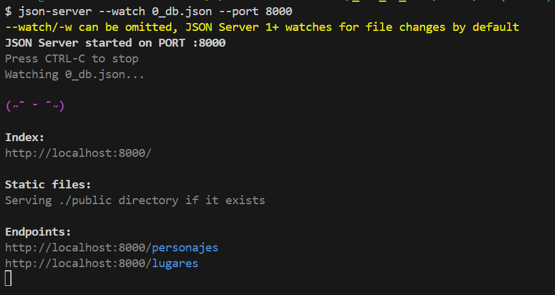

# JSON-Server

## ¿Qué es?

Es un módulo de npm. O dicho de otra forma, es un conjunto de herramientas del Node Package Manager.

Nos servirá para simular un servidor.

## ¿Cómo lo instalo?

1. [Descargar Node](https://nodejs.org/en/download)
2. Escribe en consola npm i download
3. Escribir en consola npm i -g json-server

npm -> Es la primera orden de consola, para indicar que queremos hacer algo con ese paquete.
i -> también puedes escribir "install", i es la abreviación
-g -> Instala de forma global las dependencias, para que puedas usarlas en todos los proyectos

¡Y ya está! A diferencia de postman, aquí no vamos a ver ninguna interfaz o algo similar. Pero si te sale un mensaje parecido a este, es que ha salido bien.


Para comprobar que todo es correcto, vamos a ejecutar el servidor.

1. Creamos un archivo al que llamaremos db.json
2. Ponemos dentro del archivo información mockeada (es decir, información falsa, simplemente para rellenar datos). Aquí un ejemplo.

```json
{
  "personajes": [
    {
      "nombre": "Zeus",
      "mitologia": "Griega",
      "descripcion": "Rey de los dioses, gobernante del Monte Olimpo y dios del cielo, el rayo y el trueno.",
      "grado": "Dios",
      "primera_aparicion": "Teogonía de Hesíodo"
    },
    {
      "nombre": "Odín",
      "mitologia": "Nórdica",
      "descripcion": "Padre de los dioses nórdicos, dios de la sabiduría, la poesía, la guerra y la muerte.",
      "grado": "Dios",
      "primera_aparicion": "Völuspá"
    },
    {
      "nombre": "Atenea",
      "mitologia": "Griega",
      "descripcion": "Diosa de la sabiduría, la estrategia en la guerra, las artes, la justicia y la habilidad.",
      "grado": "Diosa",
      "primera_aparicion": "Teogonía de Hesíodo"
    },
    {
      "nombre": "Artemisa",
      "mitologia": "Griega",
      "descripcion": "Diosa de la caza, la naturaleza salvaje, la virginidad, la luz lunar y el parto.",
      "grado": "Diosa",
      "primera_aparicion": "Homero, Himnos homéricos"
    },
    {
      "nombre": "Deméter",
      "mitologia": "Griega",
      "descripcion": "Diosa de la agricultura, las cosechas y la fertilidad de la tierra.",
      "grado": "Diosa",
      "primera_aparicion": "Hesíodo, Himnos homéricos"
    },
    {
      "nombre": "Thor",
      "mitologia": "Nórdica",
      "descripcion": "Dios del trueno, el rayo, el clima y la protección de la humanidad y de los dioses.",
      "grado": "Dios",
      "primera_aparicion": "Edda poética"
    },
    {
      "nombre": "Perseo",
      "mitologia": "Griega",
      "descripcion": "Héroe griego conocido por matar a Medusa y rescatar a Andrómeda.",
      "grado": "Héroe",
      "primera_aparicion": "La Ilíada"
    },
    {
      "nombre": "Freyja",
      "mitologia": "Nórdica",
      "descripcion": "Diosa del amor, la fertilidad y la belleza, así como de la guerra, la muerte y la magia.",
      "grado": "Diosa",
      "primera_aparicion": "Edda prosaica"
    },
    {
      "nombre": "Hércules",
      "mitologia": "Griega",
      "descripcion": "Héroe griego famoso por su fuerza y sus doce trabajos.",
      "grado": "Héroe",
      "primera_aparicion": "Teogonía de Hesíodo"
    },
    {
      "nombre": "Loki",
      "mitologia": "Nórdica",
      "descripcion": "Trickster y dios del fuego en la mitología nórdica, conocido por su astucia y travesuras.",
      "grado": "Dios",
      "primera_aparicion": "Edda prosaica"
    },
    {
      "nombre": "Afrodita",
      "mitologia": "Griega",
      "descripcion": "Diosa del amor, la belleza y la fertilidad.",
      "grado": "Diosa",
      "primera_aparicion": "Teogonía de Hesíodo"
    },
    {
      "nombre": "Balder",
      "mitologia": "Nórdica",
      "descripcion": "Dios de la luz, la pureza, la belleza y la justicia en la mitología nórdica.",
      "grado": "Dios",
      "primera_aparicion": "Edda poética"
    },
    {
      "nombre": "Hel",
      "mitologia": "Nórdica",
      "descripcion": "Diosa de la muerte, que gobierna sobre el reino de los muertos conocido como Helheim.",
      "grado": "Diosa",
      "primera_aparicion": "Snorri Sturluson, Edda prosaica"
    }
  ],
  "lugares": [
    {
      "nombre": "Olimpo",
      "mitologia": "Griega",
      "descripcion": "Montaña en Grecia, considerada la morada de los dioses olímpicos en la mitología griega.",
      "primera_aparicion": "Hesíodo, Teogonía"
    },
    {
      "nombre": "Elíseo",
      "mitologia": "Griega",
      "descripcion": "Elíseo era un lugar en el inframundo donde residían las almas virtuosas y justas en la mitología griega.",
      "primera_aparicion": "Homero, Ilíada"
    },
    {
      "nombre": "Tártaro",
      "mitologia": "Griega",
      "descripcion": "El Tártaro era el abismo oscuro en lo más profundo del inframundo, utilizado como prisión para los titanes y otros seres.",
      "primera_aparicion": "Hesíodo, Teogonía"
    },
    {
      "nombre": "Asgard",
      "mitologia": "Nórdica",
      "descripcion": "La morada de los dioses principales en la mitología nórdica, incluido el Salón de los Dioses, Valhalla.",
      "primera_aparicion": "Edda poética"
    },
    {
      "nombre": "Midg4rd",
      "mitologia": "Nórdica",
      "descripcion": "El mundo habitado por los humanos en la mitología nórdica, rodeado por una serpiente gigante llamada Jormungandr.",
      "primera_aparicion": "Edda poética"
    }
  ]
}
```

En este ejemplo hemos creado dentro del Json (primeros {}), 2 arrays (personajes y lugares). Veamos cómo acceder a ellos. 3. Para acceder escribimos en terminal "json-server --watch 0_db.json". Si tu archivo se llama distinto, deberás sustituir el 0_db.json por tu_archivo.json.
 4. Para acceder a los datos se nos dan varias urls. Por cada array hay una url, por ejemplo, para acceder a personajes la url es http://localhost:8000/personajes 5. Cuando queramos cerrar el servidor, presionamos control+c (en cualquier sistema operativo)

### ¡Ejercicio!

Cread vuestra propia base de datos. Pedid a chat-gpt que os rellene un json con datos de ciudades y montadlo en vuestro ordenador para que podáis verlo usando json-server.

Una vez lo hagáis, comprobad que podéis acceder desde postman.

## Manipular datos del servidor

Json-server nos facilita el trabajo de manipulación fingiendo que existe un back ordinario. Es decir, la forma que json-server nos sirve los datos es una forma bastante estandarizada.

Recuerda que si no tienes el servidor montado y ejecutándose (paso 3 de la anterior lista), nada de esto funcionará.

1. Para acceder a los datos.
   - Petición GET
   - url base. Por ejemplo: http://localhost:8000/personajes
2. Para añadir datos.
   - Petición POST
   - Debe adjuntarse un body
   - url base. Por ejemplo: http://localhost:8000/personajes
3. Para eliminar datos.
   - Petición DELETE
   - url base + /{id}. Por ejemplo: http://localhost:8000/personajes/23ds
4. Para modificar datos.
   - Petición PUT (Sustituye lo que había) o PATCH (Modifica añadiendo o sustituyendo sobre el original)
   - Debe adjuntarse un body
   - url base + /{id}. Por ejemplo: http://localhost:8000/personajes/23ds
