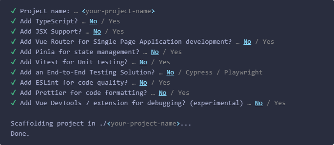

# Frameworks

## ¿Qué es un framework?
Es una forma distinta de hacer lo mismo. 

Piensa en los lenguajes de programación como en los lenguajes normales. Pongamos por caso el español. 

No lo hablarás igual si eres de Andalucía o de Barcelona. Pero tampoco se habla igual en España que en Chile o en Argentina.

Un Framework en esencia es eso, un conjunto de "palabras" o "frases" que te ayudan a decir cosas concretas. 

Por ejemplo, en Andalucía no tenemos un plato para decir "pan tumaca" y la frase "mojar una galleta" no transmite exactamente lo mismo que "sucar una galleta". 
A la inversa es poco probable que en Cataluña se entiendan expresiones como "aliquindoi", "teh qui ya, ome" o "merdellón".

Pues con los frameworks pasa exactamente esto. Cuando aprendemos un framework estamos aprendiendo este conjunto de palabra que nos facilitan el día a día.

## ¿Por qué VUE?
Es un buen punto de partida a nivel técnico ya que tiene la curva de aprendizaje más suave. Además, a nivel personal, es mi favorito. 

Vue mantiene un esquema de carpetas flexible, separa el HTML, CSS y JS, es rápido y versatil y nos sirve como punto intermedio entre Angular y React por si el día de mañana tuvieras que investigar otros frameworks. 

Facilita mucho, además, la comunicación entre componentes mediante el uso de stores, siendo el framework donde más simples son de entender y utilizar. 

## ¿Qué otros frameworks hay?
- Jquery
- Angular
- React

¡Y mucho más! Aunque estos son los más famosos.  

## ¿Qué es una SPA?
SPA -> Single Page Application

Una Single Page Application (SPA) es una aplicación web que carga una única página HTML y dinámicamente actualiza esa página según la interacción del usuario, sin necesidad de recargar la página entera desde el servidor.

Esto ahorra mucho en tiempos de carga y coste a las empresas. Menos peticiones a servidor significa menos dinero invertido en servidores.

## Qué son el Options API y el Composition API
Options API -> Forma tradicional de hacer las cosas en VUE
Composition API -> Forma moderna de hacer las cosas en VUE

Nosotros usaremos composition API, la moderna, por ser más reciente, potente y simple.

Aquí un ejemplo de código en Options vs Composition

El Html sería el mismo en ambos casos
```vue
<template>
  <div>
    <button @click="increment">Incrementar</button>
    <p>Contador: {{ counter }}</p>
  </div>
</template>
```

Options
```javaScript
<script>
export default {
  data() {
    return {
      counter: 0
    };
  },
  methods: {
    increment() {
      this.counter++;
    }
  }
};
</script>
```

Composition
```javaScript
<script setup>
    const counter = ref(0);

    function increment() {
      counter.value++;
    }
</script>
```

Como ves, en el options tienes que declarar las variables por un lado y las funciones por otro, todo metido dentro de data(). En Composition ya se encarga VUE de distinguir entre funciones y datos y hace todo lo que tiene que hacer. Menos líneas, más felicidad.

## Cómo crear un proyecto en VUE
1. Tener descargado node. (Recuerdas que ya lo habíamos usado? El "npm" que tuvimos que usar para instalar el json-server)
2. Abrir una carpeta vacía
3. En terminal -> "npm create vue@latest" !!-> Recuerda usar "sudo" si estás en mac para tener permisos de administrador. 
4. Ir rellenando el formulario que nos aparece. Aviso, el formulario puede cambiar. 

5. En la carpeta del proyecto -> npm i
6. npm run dev -> Esto hace lo mismo que el Open With Live Server. En esencia nos ejecuta la página para que comprobemos que todo es correcto. 

## Cómo cargar un proyecto de VUE
Hasta ahora cuando nos descargábamos un código de otra persona bastaba con abrirlo con open live server. En los frameworks esto es distinto. 
Para cargar un proyecto de VUE debes:
1. Descargar el proyecto en su propia carpeta, donde no haya nada más. 
2. Escribir en terminal npm i
3. npm run dev

El resto de los apuntes los encontrarás en la carpeta vue-first-project. Para abrirla correctamente debes: 
- Situar la carpeta del terminal en la carpeta fue-first-project
- npm i
- npm run dev

Deberás buscar el componente "StartUp" para ver qué está sucediendo.